# WEB STACK IMPLEMENTATION (MERN STACK) IN AWS

## 📌 Project Overview

This project demonstrates deploying a **MERN Stack** (MongoDB, Express.js, React.js, Node.js) application on an AWS EC2 Ubuntu Server.

Unlike the LEMP stack which uses MySQL and PHP, this project uses:

* **MongoDB** → NoSQL document database
* **ExpressJS** → Backend framework for Node.js
* **ReactJS** → Frontend UI framework
* **Node.js** → JavaScript runtime environment

The application built is a **To-Do Web Application** that allows users to:

* ☑ Create tasks
* ☑ View all tasks
* ☑ Delete tasks

---

## ☁️ AWS Environment Setup

### Step 0 — Preparing Prerequisites

* EC2 instance running **Ubuntu Server 24.04 LTS**
* Instance type: `t2.micro`

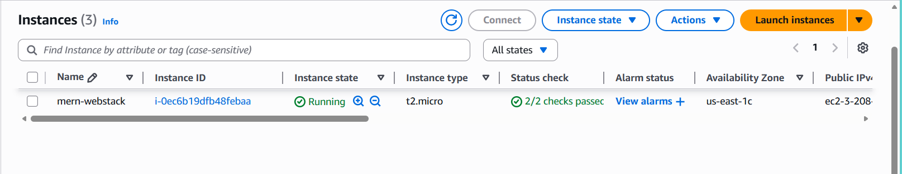

Connect to your EC2 instance:

```bash
ssh -i <Your-private-key.pem> ubuntu@<EC2-Public-IP>
```

Update Ubuntu:

```bash
sudo apt update
sudo apt upgrade -y
```

---

# 🟢 Step 1 — Install Node.js

Add NodeSource repository:

```bash
curl -fsSL https://deb.nodesource.com/setup_22.x | sudo -E bash -
```

Install Node.js:

```bash
sudo apt-get install -y nodejs
```

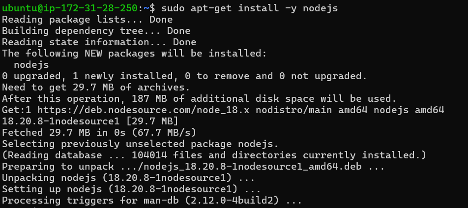

Verify installation:

```bash
node -v
npm -v
```

---

# 📁 Step 2 — Application Code Setup

Create project directory:

```bash
mkdir Todo
cd Todo
```

Initialize npm project:

```bash
npm init
```

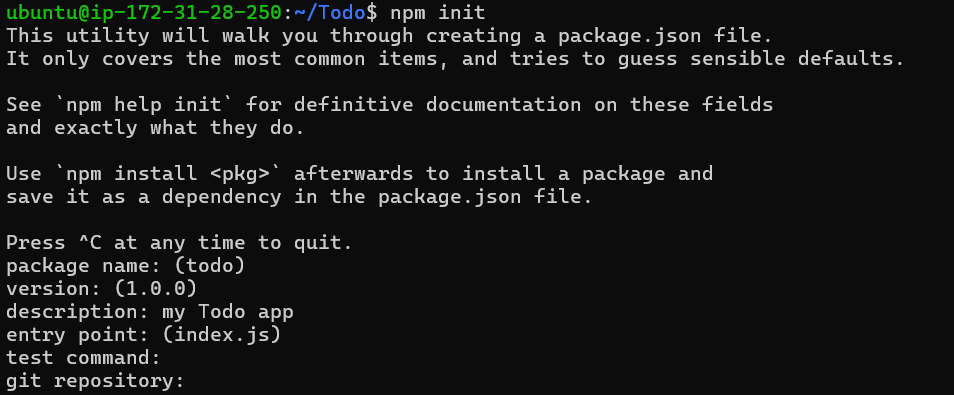

---

# 🚀 Step 3 — Install Express & Setup Server

Install Express:

```bash
npm install express
```

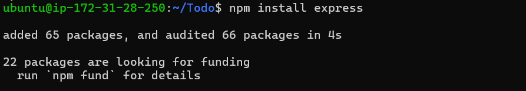

Install dotenv:

```bash
npm install dotenv
```

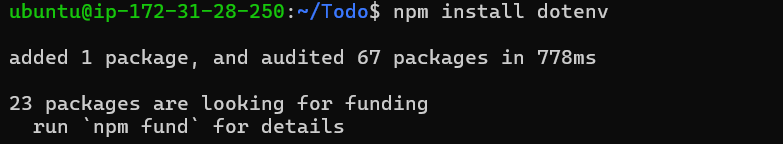

Create `index.js` and add server configuration.

Start server:

```bash
node index.js
```

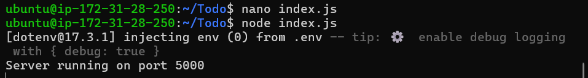

---

## 🔐 Open Port 5000 in Security Group

Add inbound rule for:

* Type: Custom TCP
* Port: 5000
* Source: 0.0.0.0/0

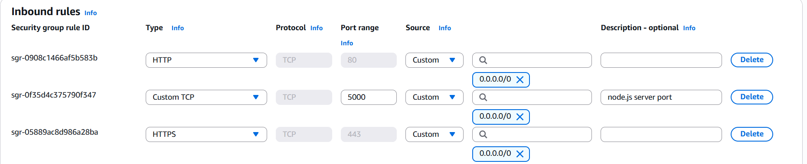

Test in browser:

```
http://<Public-IP>:5000
```

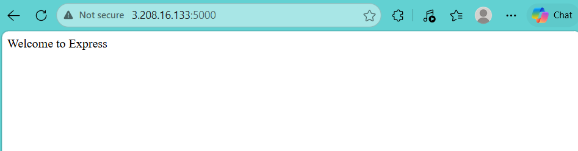

---

# 🛣 Step 4 — Create Routes

Create routes folder:

```bash
mkdir routes
cd routes
touch api.js
```

Define API endpoints:

* `GET /api/todos`
* `POST /api/todos`
* `DELETE /api/todos/:id`

---

# 🧠 Step 5 — Install Mongoose & Create Model

Install Mongoose:

```bash
npm install mongoose
```

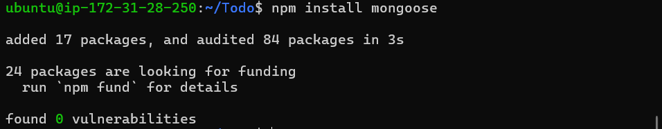

Create models directory:

```bash
mkdir models
cd models
touch todo.js
```

Define schema and model.

---

# 🗄 Step 6 — MongoDB Database Setup

Create MongoDB Atlas cluster.

Create `.env` file:

```bash
touch .env
```

Add connection string:

```env
DB = mongodb+srv://<username>:<password>@<cluster>/<dbname>?retryWrites=true&w=majority
```

Update `index.js` to connect to MongoDB.

Start server:

```bash
node index.js
```

If successful:

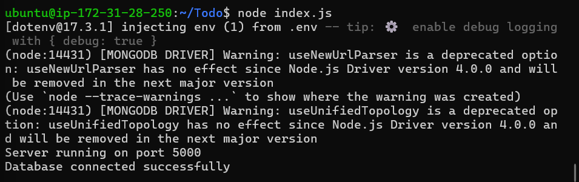

---

# 🧪 Step 7 — Testing Backend with Postman

### ➤ Create Task (POST)

```
POST http://<Public-IP>:5000/api/todos
```

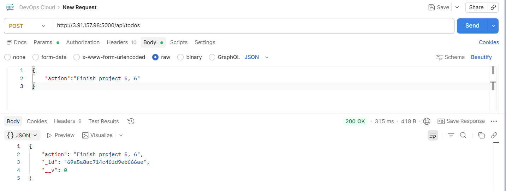

---

### ➤ Get All Tasks (GET)

```
GET http://<Public-IP>:5000/api/todos
```

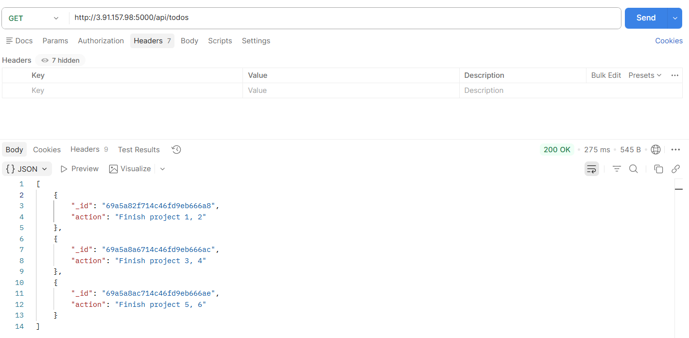

---

### ➤ Delete Task (DELETE)

```
DELETE http://<Public-IP>:5000/api/todos/:id
```

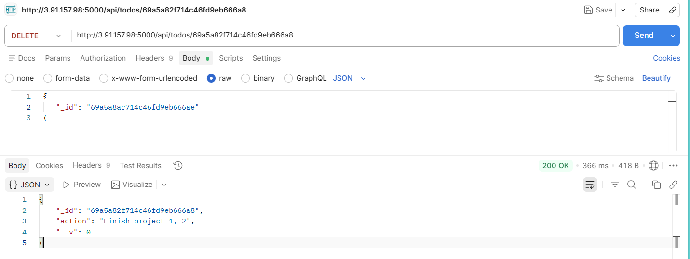

---

### ➤ Confirm After Delete

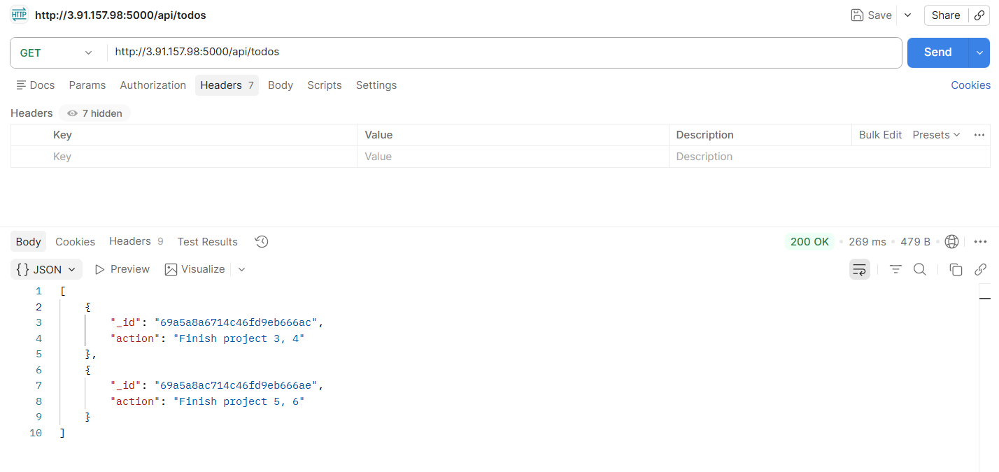

---

# 🎨 Step 8 — Frontend Setup (React)

Create React app:

```bash
npx create-react-app client
```
create-react-app is deprecated and not recommended for new projects. It was used here for learning purposes. In production projects, Vite or Next.js should be used instead.

Install dependencies:

```bash
npm install concurrently --save-dev
npm install nodemon --save-dev
```

Edit `package.json` scripts:

```json
"scripts": {
  "start": "node index.js",
  "start-watch": "nodemon index.js",
  "dev": "concurrently \"npm run start-watch\" \"cd client && npm start\""
}
```

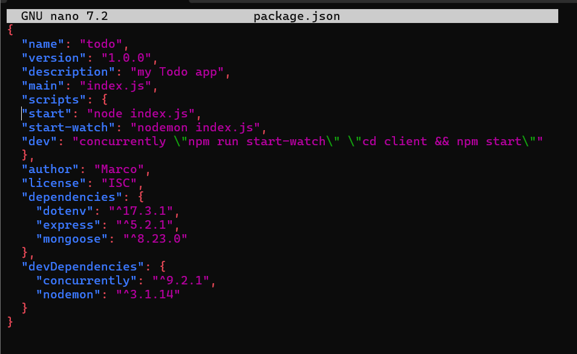

---

## 🔄 Configure Proxy

Inside `client/package.json` add:

```json
"proxy": "http://localhost:5000"
```

---

# 🔐 Open Port 3000

Add inbound rule:

* Port: 3000

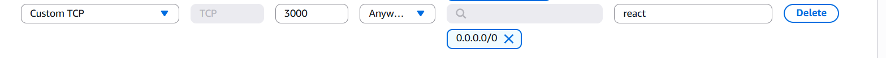

Run application:

```bash
npm run dev
```

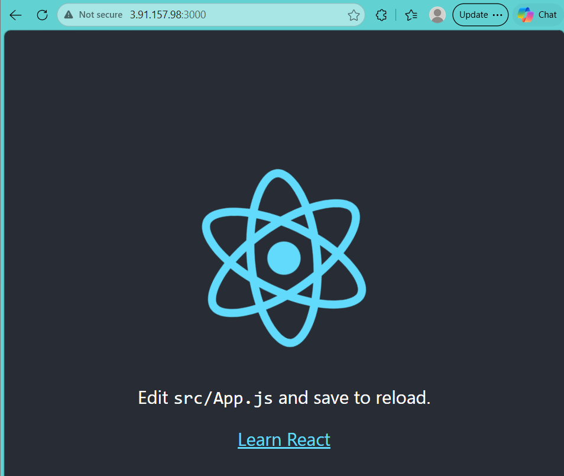

---

# 🖥 Final Application

Access:

```
http://<Public-IP>:3000
```

Your To-Do app interface:

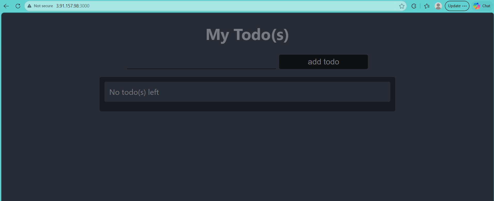

---

# ✅ Project Complete

Your **MERN stack application** is fully operational:

* ☑ Ubuntu Linux Server
* ☑ Node.js Backend
* ☑ Express RESTful API
* ☑ MongoDB Atlas Database
* ☑ React Frontend
* ☑ Full CRUD Operations

---

# 📚 Side Self Study Topics

* Types of DBMS (Relational vs NoSQL)
* Web Application Frameworks (Backend & Frontend)
* RESTful APIs
* JavaScript Basics
* CSS Fundamentals

---

# 📎 Notes

* Always STOP unused EC2 instances to save Free Tier hours.
* Keep your `.pem` file secure.
* Never expose `.env` file publicly.
* Public IP changes after restarting EC2 unless Elastic IP is used.

---

# 👨‍💻 Author

**Marco Raafat Zakaria**
Steghub Scholarship
Faculty of Computers & Artificial Intelligence – Cairo University

---

